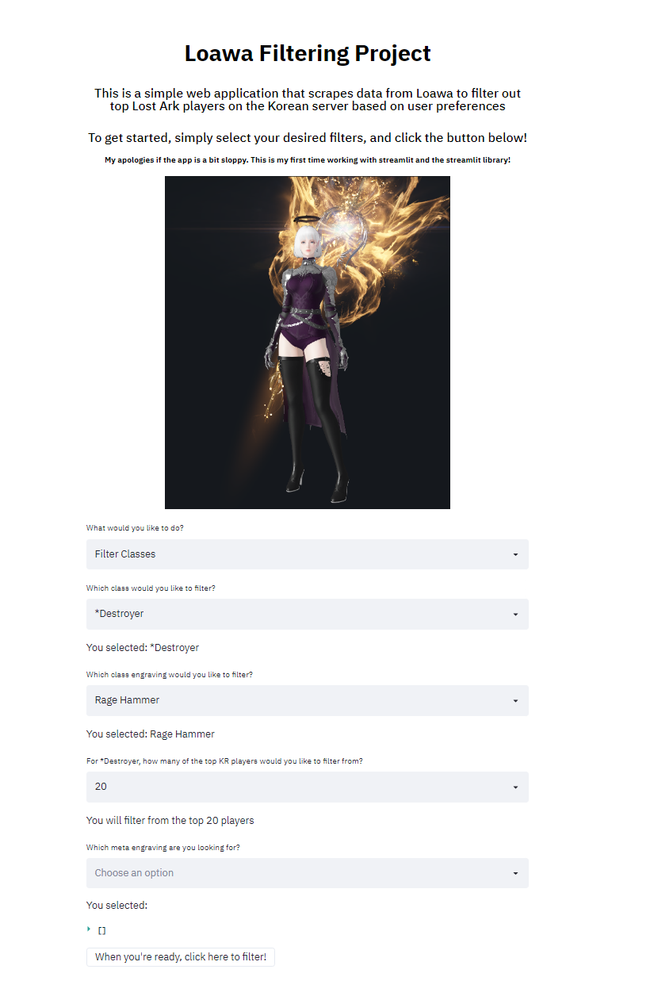
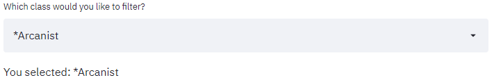
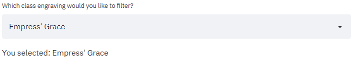
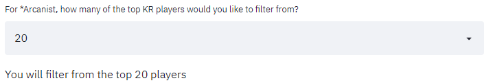
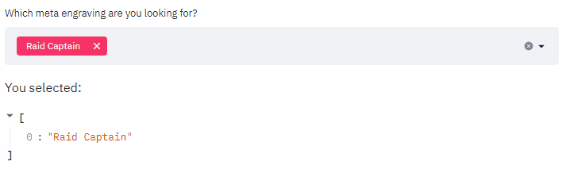
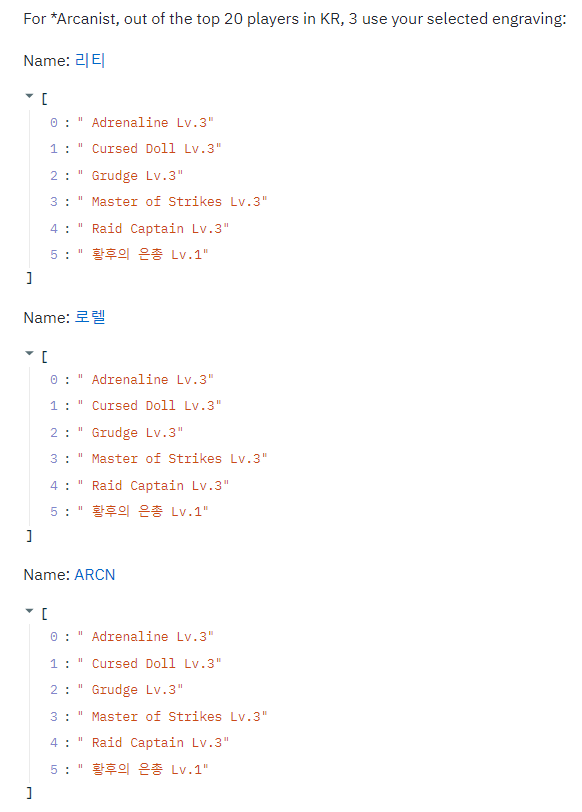

# Loawa_Filtering_Project
### This is a simple web application that let's the user filter out top Lost Ark players on the Korean server based on their class and engravings

Lost Ark is a Korean MMORPG that has been published and distrubted in the west by Amazon Games Studio. Currently, the western release of the game is behind in terms of content compared to the Korean version of the game, so many players in the west look to top players on the KR server for different builds and character setups. 

Loawa is a fanmade website that contains the data of every top character on the KR server, allowing users to see the different aspects of the characters such as skills, engravings, gems, etc. Because the korean version of the game is ahead of the western version, Loawa becomes a great resources for western players to see what the optimal/meta builds are for different classes based on the top players on the KR server.

## The Inspiration and Issue
I sometimes like to use Loawa to look at what the common builds are for certain classes. One day I had an idea for an engraving setup for one of the classes I play, and I wanted to see if any of the top players in Korea used a similar build.

However, the issue with Loawa is that when it comes to filtering out top characters, the filtering is limited by class. You cannot filter characters based on engravings, skills, gems, etc. This meant that if I wanted to search for players with my particular engraving setup in mind, I'd have to go through every player one-by-one and see if they had the setup that I was looking for. This was the main prompt that inspired me to make this project; an application that allowed the user to filter out top players on the Korean version of the game with more filtering options that are not available on the Loawa website.

## The Process

1. We first ask the user to input that class that they would like to filter:

2. We then ask the user for the specific class engraving that they would like to filter:

3. Next, we ask the user how many profiles they would like to search through:

4. Finally, we ask for which meta engravings they would like to filter. The user can select multiple engravings for a more sophisticated search:

5. Once the above are complete, all that's left is to click the button and let the filter process play out! Here's a video demonstration of how the process works out:

https://user-images.githubusercontent.com/116387870/214235922-5c7945c1-3ba0-4b7f-adc8-7752d4bcb0a0.mp4

Here is an image of what the results look like. As of now, the application can only display the equipped engravings of the character, but if the user wishes to see the profile, the character's name is displayed with a hyperlink that leads to the full character profile link.

## Future Plans

- Have the results also display the level of the character next to the name
- Add a headless option to hide the browser
- Display a photo of the character (Similar to the image at the top of the page, but smaller)
- Add optional filters such as skills, gems, cards, equipped armor, etc.
